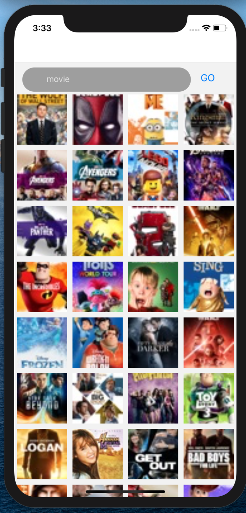

# RnAssignment

## Available Scripts

In the project directory, you can run:

### `npx react-native run-android`

### `npx react-native run-ios`

### `npm run test`

## Search sceern

[]

[]

## Details screen

[]

